Customer Data Analysis
================

``` r
# load customer data
customers <- read.csv("data/customer_info.csv", stringsAsFactors = TRUE)
# load product data
products <- read.csv("data/product_info.csv", stringsAsFactors = TRUE)
# load customer product data
customer_products <- read.csv("data/customer_product.csv")#, stringsAsFactors = TRUE)
```

``` r
#Identify number of records
dim(customers)
```

    ## [1] 508932      4

``` r
dim(products)
```

    ## [1] 2 4

``` r
dim(customer_products)
```

    ## [1] 508932      5

``` r
#view customer data
summary(customers)
```

    ##        X           customer_id          age           gender      
    ##  Min.   :     1   C10000 :     1   Min.   :21.00   female:199002  
    ##  1st Qu.:127234   C100000:     1   1st Qu.:53.00   male  :309930  
    ##  Median :254467   C100001:     1   Median :59.00                  
    ##  Mean   :254467   C100002:     1   Mean   :58.47                  
    ##  3rd Qu.:381699   C100003:     1   3rd Qu.:64.00                  
    ##  Max.   :508932   C100004:     1   Max.   :78.00                  
    ##                   (Other):508926

``` r
#view customer data
summary(products)
```

    ##  product_id                   name       price        billing_cycle  
    ##  prd_1:1    annual_subscription :1   Min.   : 125.0   Min.   : 1.00  
    ##  prd_2:1    monthly_subscription:1   1st Qu.: 393.8   1st Qu.: 3.75  
    ##                                      Median : 662.5   Median : 6.50  
    ##                                      Mean   : 662.5   Mean   : 6.50  
    ##                                      3rd Qu.: 931.2   3rd Qu.: 9.25  
    ##                                      Max.   :1200.0   Max.   :12.00

``` r
#view customer data
summary(customer_products)
```

    ##        X          customer_id          product          signup_date_time  
    ##  Min.   :     1   Length:508932      Length:508932      Length:508932     
    ##  1st Qu.:127234   Class :character   Class :character   Class :character  
    ##  Median :254467   Mode  :character   Mode  :character   Mode  :character  
    ##  Mean   :254467                                                           
    ##  3rd Qu.:381699                                                           
    ##  Max.   :508932                                                           
    ##  cancel_date_time  
    ##  Length:508932     
    ##  Class :character  
    ##  Mode  :character  
    ##                    
    ##                    
    ## 

``` r
#view customer data structure
str(customers)
```

    ## 'data.frame':    508932 obs. of  4 variables:
    ##  $ X          : int  1 2 3 4 5 6 7 8 9 10 ...
    ##  $ customer_id: Factor w/ 508932 levels "C10000","C100000",..: 159281 159392 159503 159614 159725 159836 159947 160058 160169 160280 ...
    ##  $ age        : int  76 61 58 62 71 56 53 53 70 68 ...
    ##  $ gender     : Factor w/ 2 levels "female","male": 1 2 1 1 2 2 2 1 1 2 ...

``` r
#view customer data structure
str(products)
```

    ## 'data.frame':    2 obs. of  4 variables:
    ##  $ product_id   : Factor w/ 2 levels "prd_1","prd_2": 1 2
    ##  $ name         : Factor w/ 2 levels "annual_subscription",..: 1 2
    ##  $ price        : int  1200 125
    ##  $ billing_cycle: int  12 1

``` r
#view customer data structure
str(customer_products)
```

    ## 'data.frame':    508932 obs. of  5 variables:
    ##  $ X               : int  1 2 3 4 5 6 7 8 9 10 ...
    ##  $ customer_id     : chr  "C2448" "C2449" "C2450" "C2451" ...
    ##  $ product         : chr  "prd_1" "prd_1" "prd_1" "prd_2" ...
    ##  $ signup_date_time: chr  "2017-01-01 10:35:09" "2017-01-01 11:39:29" "2017-01-01 11:42:00" "2017-01-01 13:32:08" ...
    ##  $ cancel_date_time: chr  NA "2021-09-05 10:00:02" "2019-01-13 16:24:55" NA ...

``` r
#Cleaning of Customer Data

#remove unwanted column
customers_clean <- customers[,c(2:4)]
```

``` r
#view summary of cleaned data
summary(customers_clean)
```

    ##   customer_id          age           gender      
    ##  C10000 :     1   Min.   :21.00   female:199002  
    ##  C100000:     1   1st Qu.:53.00   male  :309930  
    ##  C100001:     1   Median :59.00                  
    ##  C100002:     1   Mean   :58.47                  
    ##  C100003:     1   3rd Qu.:64.00                  
    ##  C100004:     1   Max.   :78.00                  
    ##  (Other):508926

``` r
#view a subset of cleaned data
head(customers_clean)
```

    ##   customer_id age gender
    ## 1       C2448  76 female
    ## 2       C2449  61   male
    ## 3       C2450  58 female
    ## 4       C2451  62 female
    ## 5       C2452  71   male
    ## 6       C2453  56   male

``` r
#view data structure of customer product data
str(customer_products)
```

    ## 'data.frame':    508932 obs. of  5 variables:
    ##  $ X               : int  1 2 3 4 5 6 7 8 9 10 ...
    ##  $ customer_id     : chr  "C2448" "C2449" "C2450" "C2451" ...
    ##  $ product         : chr  "prd_1" "prd_1" "prd_1" "prd_2" ...
    ##  $ signup_date_time: chr  "2017-01-01 10:35:09" "2017-01-01 11:39:29" "2017-01-01 11:42:00" "2017-01-01 13:32:08" ...
    ##  $ cancel_date_time: chr  NA "2021-09-05 10:00:02" "2019-01-13 16:24:55" NA ...

``` r
#seeing that date time comes in as factor
# bring in lubridate to handle datetime
library(lubridate, warn.conflicts = FALSE)
```

``` r
#Cleaning of Customer Product Data

#remove unwanted column
customer_product_clean <- customer_products[,c(2:5)]

#convert the date time column to datetime type
customer_product_clean$signup_date_time <- ymd_hms(customer_product_clean$signup_date_time)
customer_product_clean$cancel_date_time <- ymd_hms(customer_product_clean$cancel_date_time)
```

``` r
#rename product column in customer_product to product_id
colnames(customer_product_clean)[2] <- "product_id"
#rename name column in product to subscription
colnames(products)[2] <- "subscription"
```

``` r
#combining data frames (customer product clean and products)
customer_consolidated_data = merge(x=customer_product_clean, y=products, by ="product_id", all.x = TRUE)
#combining data frames (customer consolidated data and customer data)
customer_consolidated_data = merge(x=customer_consolidated_data, y=customers_clean, by ="customer_id", all.x = TRUE)

head(customer_consolidated_data)
```

    ##   customer_id product_id    signup_date_time cancel_date_time
    ## 1      C10000      prd_1 2017-07-09 12:55:31             <NA>
    ## 2     C100000      prd_2 2021-02-13 11:41:49             <NA>
    ## 3     C100001      prd_1 2021-02-13 11:45:50             <NA>
    ## 4     C100002      prd_1 2021-02-13 11:51:02             <NA>
    ## 5     C100003      prd_1 2021-02-13 11:56:54             <NA>
    ## 6     C100004      prd_1 2021-02-13 12:05:35             <NA>
    ##           subscription price billing_cycle age gender
    ## 1  annual_subscription  1200            12  46 female
    ## 2 monthly_subscription   125             1  54 female
    ## 3  annual_subscription  1200            12  27 female
    ## 4  annual_subscription  1200            12  47 female
    ## 5  annual_subscription  1200            12  63 female
    ## 6  annual_subscription  1200            12  40   male

``` r
str(customer_consolidated_data)
```

    ## 'data.frame':    508932 obs. of  9 variables:
    ##  $ customer_id     : chr  "C10000" "C100000" "C100001" "C100002" ...
    ##  $ product_id      : chr  "prd_1" "prd_2" "prd_1" "prd_1" ...
    ##  $ signup_date_time: POSIXct, format: "2017-07-09 12:55:31" "2021-02-13 11:41:49" ...
    ##  $ cancel_date_time: POSIXct, format: NA NA ...
    ##  $ subscription    : Factor w/ 2 levels "annual_subscription",..: 1 2 1 1 1 1 2 2 1 2 ...
    ##  $ price           : int  1200 125 1200 1200 1200 1200 125 125 1200 125 ...
    ##  $ billing_cycle   : int  12 1 12 12 12 12 1 1 12 1 ...
    ##  $ age             : int  46 54 27 47 63 40 69 48 60 60 ...
    ##  $ gender          : Factor w/ 2 levels "female","male": 1 1 1 1 1 2 1 1 2 1 ...

``` r
#duplicate dataframe for manipulation purpose
consolidated_modified <- customer_consolidated_data
```

``` r
#Signup analytic breakdown
consolidated_modified$yearIn <- strftime(consolidated_modified$signup_date_time, "%Y")
consolidated_modified$monthIn <- strftime(consolidated_modified$signup_date_time, "%h")
consolidated_modified$dayIn <- strftime(consolidated_modified$signup_date_time, "%d")
consolidated_modified$dayNameIn <- strftime(consolidated_modified$signup_date_time, "%a")
consolidated_modified$hourIn <- strftime(consolidated_modified$signup_date_time, "%H")
consolidated_modified$minuteIn <- strftime(consolidated_modified$signup_date_time, "%M")
consolidated_modified$AMPMIn <- strftime(consolidated_modified$signup_date_time, "%p")
```

``` r
#Signup analytic breakdown
consolidated_modified$yearOut <- strftime(consolidated_modified$cancel_date_time, "%Y")
consolidated_modified$monthOut <- strftime(consolidated_modified$cancel_date_time, "%h")
consolidated_modified$dayOut <- strftime(consolidated_modified$cancel_date_time, "%d")
consolidated_modified$dayNameOut <- strftime(consolidated_modified$cancel_date_time, "%a")
consolidated_modified$hourOut <- strftime(consolidated_modified$cancel_date_time, "%H")
consolidated_modified$minuteOut <- strftime(consolidated_modified$cancel_date_time, "%M")
consolidated_modified$AMPMOut <- strftime(consolidated_modified$cancel_date_time, "%p")
```

``` r
str(consolidated_modified)
```

    ## 'data.frame':    508932 obs. of  23 variables:
    ##  $ customer_id     : chr  "C10000" "C100000" "C100001" "C100002" ...
    ##  $ product_id      : chr  "prd_1" "prd_2" "prd_1" "prd_1" ...
    ##  $ signup_date_time: POSIXct, format: "2017-07-09 12:55:31" "2021-02-13 11:41:49" ...
    ##  $ cancel_date_time: POSIXct, format: NA NA ...
    ##  $ subscription    : Factor w/ 2 levels "annual_subscription",..: 1 2 1 1 1 1 2 2 1 2 ...
    ##  $ price           : int  1200 125 1200 1200 1200 1200 125 125 1200 125 ...
    ##  $ billing_cycle   : int  12 1 12 12 12 12 1 1 12 1 ...
    ##  $ age             : int  46 54 27 47 63 40 69 48 60 60 ...
    ##  $ gender          : Factor w/ 2 levels "female","male": 1 1 1 1 1 2 1 1 2 1 ...
    ##  $ yearIn          : chr  "2017" "2021" "2021" "2021" ...
    ##  $ monthIn         : chr  "Jul" "Feb" "Feb" "Feb" ...
    ##  $ dayIn           : chr  "09" "13" "13" "13" ...
    ##  $ dayNameIn       : chr  "Sun" "Sat" "Sat" "Sat" ...
    ##  $ hourIn          : chr  "13" "11" "11" "11" ...
    ##  $ minuteIn        : chr  "55" "41" "45" "51" ...
    ##  $ AMPMIn          : chr  "PM" "AM" "AM" "AM" ...
    ##  $ yearOut         : chr  NA NA NA NA ...
    ##  $ monthOut        : chr  NA NA NA NA ...
    ##  $ dayOut          : chr  NA NA NA NA ...
    ##  $ dayNameOut      : chr  NA NA NA NA ...
    ##  $ hourOut         : chr  NA NA NA NA ...
    ##  $ minuteOut       : chr  NA NA NA NA ...
    ##  $ AMPMOut         : chr  NA NA NA NA ...

``` r
#convert factorizable columns to factor
consolidated_modified$yearIn <- factor(consolidated_modified$yearIn)
consolidated_modified$yearOut <- factor(consolidated_modified$yearOut)
consolidated_modified$monthIn <- factor(consolidated_modified$monthIn)
consolidated_modified$monthOut <- factor(consolidated_modified$monthOut)
consolidated_modified$dayNameIn <- factor(consolidated_modified$dayNameIn)
consolidated_modified$dayNameOut <- factor(consolidated_modified$dayNameOut)
consolidated_modified$AMPMIn <- factor(consolidated_modified$AMPMIn)
consolidated_modified$AMPMOut <- factor(consolidated_modified$AMPMOut)
```

``` r
str(consolidated_modified)
```

    ## 'data.frame':    508932 obs. of  23 variables:
    ##  $ customer_id     : chr  "C10000" "C100000" "C100001" "C100002" ...
    ##  $ product_id      : chr  "prd_1" "prd_2" "prd_1" "prd_1" ...
    ##  $ signup_date_time: POSIXct, format: "2017-07-09 12:55:31" "2021-02-13 11:41:49" ...
    ##  $ cancel_date_time: POSIXct, format: NA NA ...
    ##  $ subscription    : Factor w/ 2 levels "annual_subscription",..: 1 2 1 1 1 1 2 2 1 2 ...
    ##  $ price           : int  1200 125 1200 1200 1200 1200 125 125 1200 125 ...
    ##  $ billing_cycle   : int  12 1 12 12 12 12 1 1 12 1 ...
    ##  $ age             : int  46 54 27 47 63 40 69 48 60 60 ...
    ##  $ gender          : Factor w/ 2 levels "female","male": 1 1 1 1 1 2 1 1 2 1 ...
    ##  $ yearIn          : Factor w/ 5 levels "2017","2018",..: 1 5 5 5 5 5 5 5 5 5 ...
    ##  $ monthIn         : Factor w/ 12 levels "Apr","Aug","Dec",..: 6 4 4 4 4 4 4 4 4 4 ...
    ##  $ dayIn           : chr  "09" "13" "13" "13" ...
    ##  $ dayNameIn       : Factor w/ 7 levels "Fri","Mon","Sat",..: 4 3 3 3 3 3 3 3 3 3 ...
    ##  $ hourIn          : chr  "13" "11" "11" "11" ...
    ##  $ minuteIn        : chr  "55" "41" "45" "51" ...
    ##  $ AMPMIn          : Factor w/ 2 levels "AM","PM": 2 1 1 1 1 2 2 2 2 2 ...
    ##  $ yearOut         : Factor w/ 5 levels "2017","2018",..: NA NA NA NA NA NA NA NA NA NA ...
    ##  $ monthOut        : Factor w/ 12 levels "Apr","Aug","Dec",..: NA NA NA NA NA NA NA NA NA NA ...
    ##  $ dayOut          : chr  NA NA NA NA ...
    ##  $ dayNameOut      : Factor w/ 7 levels "Fri","Mon","Sat",..: NA NA NA NA NA NA NA NA NA NA ...
    ##  $ hourOut         : chr  NA NA NA NA ...
    ##  $ minuteOut       : chr  NA NA NA NA ...
    ##  $ AMPMOut         : Factor w/ 2 levels "AM","PM": NA NA NA NA NA NA NA NA NA NA ...

``` r
#Descriptive Information
#Average age of customers based on gender
with(consolidated_modified, by(age, gender, mean))
```

    ## gender: female
    ## [1] 58.34073
    ## ------------------------------------------------------------ 
    ## gender: male
    ## [1] 58.55798

``` r
#loading ggplot library
library(ggplot2)
```

``` r
ggplot(consolidated_modified,aes(y=age, x=gender, fill=gender )) + geom_boxplot() + coord_flip()+ scale_fill_brewer(palette = "Set1")
```

<!-- -->

``` r
#Creating dataframe for cancellations of subscriptions
consolidated_cancellation <- consolidated_modified
consolidated_cancellation <-na.omit(consolidated_cancellation)

head(consolidated_cancellation)
```

    ##    customer_id product_id    signup_date_time    cancel_date_time
    ## 11     C100009      prd_2 2021-02-13 12:22:02 2021-12-26 14:07:50
    ## 15     C100012      prd_1 2021-02-13 12:42:20 2021-02-23 16:45:25
    ## 17     C100014      prd_2 2021-02-13 13:01:18 2021-11-09 16:59:34
    ## 23      C10002      prd_1 2017-07-10 06:27:10 2019-01-03 09:51:28
    ## 26     C100022      prd_2 2021-02-13 14:11:18 2021-09-21 11:25:56
    ## 27     C100023      prd_1 2021-02-13 14:14:05 2021-06-12 15:07:44
    ##            subscription price billing_cycle age gender yearIn monthIn dayIn
    ## 11 monthly_subscription   125             1  75   male   2021     Feb    13
    ## 15  annual_subscription  1200            12  43   male   2021     Feb    13
    ## 17 monthly_subscription   125             1  57   male   2021     Feb    13
    ## 23  annual_subscription  1200            12  58 female   2017     Jul    10
    ## 26 monthly_subscription   125             1  47 female   2021     Feb    13
    ## 27  annual_subscription  1200            12  50 female   2021     Feb    13
    ##    dayNameIn hourIn minuteIn AMPMIn yearOut monthOut dayOut dayNameOut hourOut
    ## 11       Sat     12       22     PM    2021      Dec     26        Sun      14
    ## 15       Sat     12       42     PM    2021      Feb     23        Tue      16
    ## 17       Sat     13       01     PM    2021      Nov     09        Tue      16
    ## 23       Mon     07       27     AM    2019      Jan     03        Thu      09
    ## 26       Sat     14       11     PM    2021      Sep     21        Tue      12
    ## 27       Sat     14       14     PM    2021      Jun     12        Sat      16
    ##    minuteOut AMPMOut
    ## 11        07      PM
    ## 15        45      PM
    ## 17        59      PM
    ## 23        51      AM
    ## 26        25      PM
    ## 27        07      PM

``` r
str(consolidated_cancellation)
```

    ## 'data.frame':    112485 obs. of  23 variables:
    ##  $ customer_id     : chr  "C100009" "C100012" "C100014" "C10002" ...
    ##  $ product_id      : chr  "prd_2" "prd_1" "prd_2" "prd_1" ...
    ##  $ signup_date_time: POSIXct, format: "2021-02-13 12:22:02" "2021-02-13 12:42:20" ...
    ##  $ cancel_date_time: POSIXct, format: "2021-12-26 14:07:50" "2021-02-23 16:45:25" ...
    ##  $ subscription    : Factor w/ 2 levels "annual_subscription",..: 2 1 2 1 2 1 2 2 2 2 ...
    ##  $ price           : int  125 1200 125 1200 125 1200 125 125 125 125 ...
    ##  $ billing_cycle   : int  1 12 1 12 1 12 1 1 1 1 ...
    ##  $ age             : int  75 43 57 58 47 50 70 41 49 57 ...
    ##  $ gender          : Factor w/ 2 levels "female","male": 2 2 2 1 1 1 2 2 2 1 ...
    ##  $ yearIn          : Factor w/ 5 levels "2017","2018",..: 5 5 5 1 5 5 5 5 5 5 ...
    ##  $ monthIn         : Factor w/ 12 levels "Apr","Aug","Dec",..: 4 4 4 6 4 4 4 4 4 4 ...
    ##  $ dayIn           : chr  "13" "13" "13" "10" ...
    ##  $ dayNameIn       : Factor w/ 7 levels "Fri","Mon","Sat",..: 3 3 3 2 3 3 3 4 4 4 ...
    ##  $ hourIn          : chr  "12" "12" "13" "07" ...
    ##  $ minuteIn        : chr  "22" "42" "01" "27" ...
    ##  $ AMPMIn          : Factor w/ 2 levels "AM","PM": 2 2 2 1 2 2 2 1 1 1 ...
    ##  $ yearOut         : Factor w/ 5 levels "2017","2018",..: 5 5 5 3 5 5 5 5 5 5 ...
    ##  $ monthOut        : Factor w/ 12 levels "Apr","Aug","Dec",..: 3 4 10 5 12 7 9 3 6 9 ...
    ##  $ dayOut          : chr  "26" "23" "09" "03" ...
    ##  $ dayNameOut      : Factor w/ 7 levels "Fri","Mon","Sat",..: 4 6 6 5 6 3 5 5 1 4 ...
    ##  $ hourOut         : chr  "14" "16" "16" "09" ...
    ##  $ minuteOut       : chr  "07" "45" "59" "51" ...
    ##  $ AMPMOut         : Factor w/ 2 levels "AM","PM": 2 2 2 1 2 2 2 2 2 2 ...
    ##  - attr(*, "na.action")= 'omit' Named int [1:396447] 1 2 3 4 5 6 7 8 9 10 ...
    ##   ..- attr(*, "names")= chr [1:396447] "1" "2" "3" "4" ...

``` r
summary(consolidated_cancellation)
```

    ##  customer_id         product_id        signup_date_time             
    ##  Length:112485      Length:112485      Min.   :2017-01-01 10:14:28  
    ##  Class :character   Class :character   1st Qu.:2018-07-11 14:54:08  
    ##  Mode  :character   Mode  :character   Median :2019-07-11 08:20:30  
    ##                                        Mean   :2019-06-28 10:54:26  
    ##                                        3rd Qu.:2020-05-26 17:16:48  
    ##                                        Max.   :2021-12-26 10:37:59  
    ##                                                                     
    ##  cancel_date_time                            subscription       price       
    ##  Min.   :2017-01-08 15:14:53   annual_subscription :69682   Min.   : 125.0  
    ##  1st Qu.:2020-03-03 15:25:12   monthly_subscription:42803   1st Qu.: 125.0  
    ##  Median :2020-12-29 13:24:10                                Median :1200.0  
    ##  Mean   :2020-09-29 23:06:47                                Mean   : 790.9  
    ##  3rd Qu.:2021-07-22 10:59:54                                3rd Qu.:1200.0  
    ##  Max.   :2021-12-31 21:44:10                                Max.   :1200.0  
    ##                                                                             
    ##  billing_cycle         age           gender       yearIn         monthIn     
    ##  Min.   : 1.000   Min.   :23.00   female:44229   2017:13376   Jan    :14593  
    ##  1st Qu.: 1.000   1st Qu.:53.00   male  :68256   2018:21241   Mar    :13696  
    ##  Median :12.000   Median :59.00                  2019:32797   Apr    :12897  
    ##  Mean   : 7.814   Mean   :58.42                  2020:30315   Feb    :12596  
    ##  3rd Qu.:12.000   3rd Qu.:64.00                  2021:14756   May    :12161  
    ##  Max.   :12.000   Max.   :78.00                               Jun    :10347  
    ##                                                               (Other):36195  
    ##     dayIn           dayNameIn      hourIn            minuteIn        
    ##  Length:112485      Fri:14821   Length:112485      Length:112485     
    ##  Class :character   Mon:23794   Class :character   Class :character  
    ##  Mode  :character   Sat: 7781   Mode  :character   Mode  :character  
    ##                     Sun: 5907                                        
    ##                     Thu:18489                                        
    ##                     Tue:21616                                        
    ##                     Wed:20077                                        
    ##  AMPMIn     yearOut         monthOut        dayOut          dayNameOut 
    ##  AM:27507   2017: 1779   Dec    :12043   Length:112485      Fri:16154  
    ##  PM:84978   2018: 6447   Nov    :11270   Class :character   Mon:16103  
    ##             2019:15841   Oct    :11138   Mode  :character   Sat:16168  
    ##             2020:32500   Sep    :10605                      Sun:16041  
    ##             2021:55918   Aug    :10414                      Thu:16119  
    ##                          Jul    : 9942                      Tue:15795  
    ##                          (Other):47073                      Wed:16105  
    ##    hourOut           minuteOut         AMPMOut   
    ##  Length:112485      Length:112485      AM:22034  
    ##  Class :character   Class :character   PM:90451  
    ##  Mode  :character   Mode  :character             
    ##                                                  
    ##                                                  
    ##                                                  
    ## 

``` r
#install.packages("patchwork")
library(patchwork)
```

``` r
summary(consolidated_modified$subscription)
```

    ##  annual_subscription monthly_subscription 
    ##               325649               183283

``` r
summary(consolidated_modified$yearIn)
```

    ##   2017   2018   2019   2020   2021 
    ##  30896  58099 109876 145642 164419

``` r
plot1 <- ggplot(consolidated_modified,aes(x=subscription, fill=subscription)) + geom_bar(stat = "count")
plot2 <- ggplot(consolidated_modified,aes(x=yearIn)) + geom_bar(stat = "count")

plot1 + plot2
```

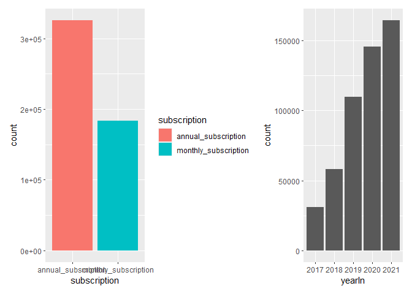<!-- -->

``` r
ggplot(consolidated_cancellation,aes(x=yearOut, fill= gender)) + geom_bar(stat = "count")
```

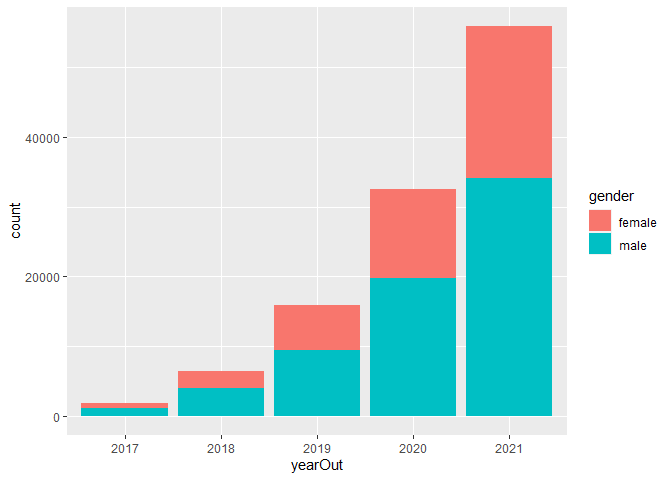<!-- -->

``` r
ggplot(consolidated_modified,aes(x=monthIn, fill = gender)) + geom_bar(stat = "count") + coord_flip()
```

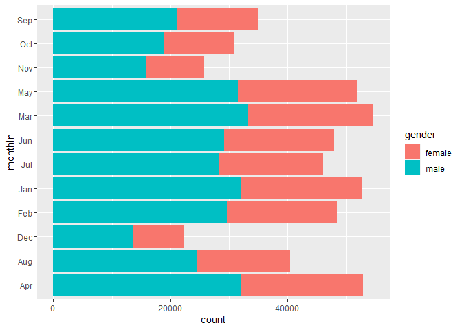<!-- -->

``` r
ggplot(consolidated_cancellation,aes(x=monthOut, fill = gender)) + geom_bar(stat = "count") + coord_flip()
```

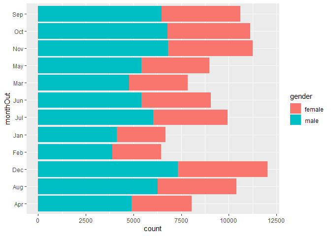<!-- -->

``` r
ggplot(consolidated_modified,aes(x=yearIn)) + geom_bar(stat = "count") + ggtitle("Signup Annual Frequency")
```

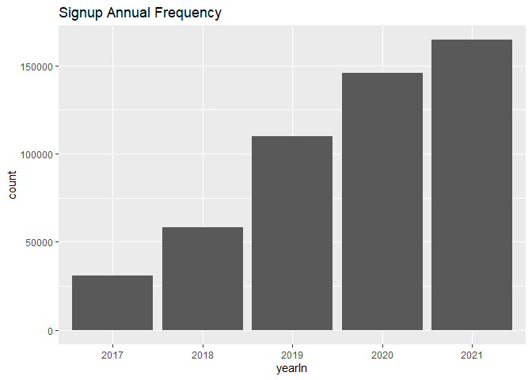<!-- -->

``` r
ggplot(consolidated_cancellation,aes(x=yearOut)) + geom_bar(stat = "count") + ggtitle("Cancellation Annual Frequency")
```

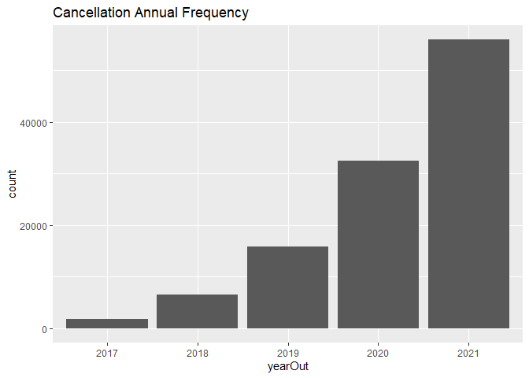<!-- -->

``` r
ggplot(consolidated_modified,aes(x=monthIn, fill=subscription)) + geom_bar(stat = "count") + ggtitle("Signup Monthly Frequency")
```

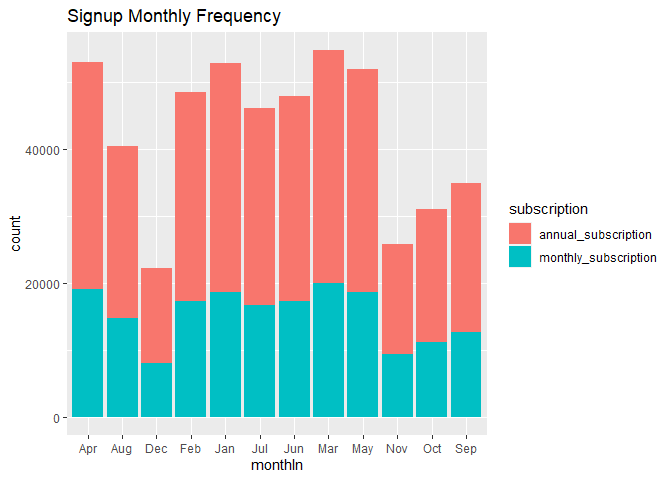<!-- -->

``` r
ggplot(consolidated_cancellation,aes(x=monthOut, fill=subscription)) + geom_bar(stat = "count") + ggtitle("Cancellation Monthly Frequency")
```

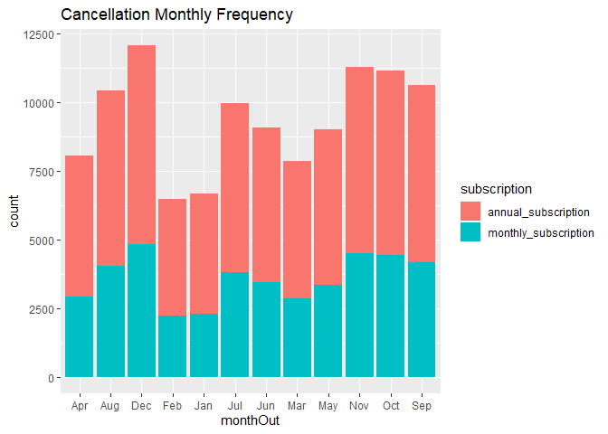<!-- -->

``` r
ggplot(consolidated_modified,aes(x=dayNameIn, fill=subscription)) + geom_bar(stat = "count") + ggtitle("Signup by Day of the Week")
```

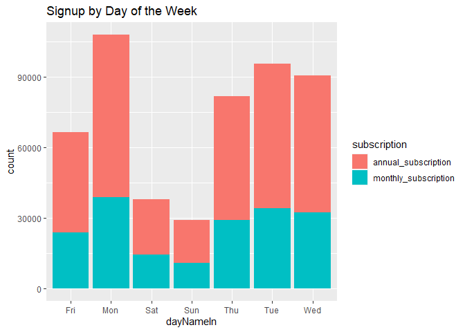<!-- -->

``` r
ggplot(consolidated_cancellation,aes(x=dayNameOut, fill=subscription)) + geom_bar(stat = "count") + ggtitle("Cancellation by Day of the Week")
```

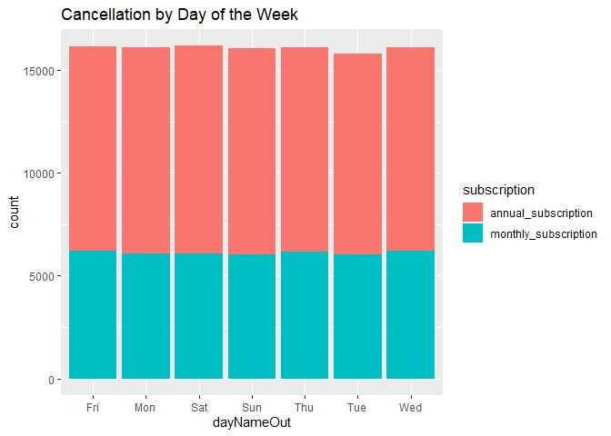<!-- -->

``` r
ggplot(consolidated_modified,aes(x=dayIn, fill=subscription)) + geom_bar(stat = "count") + ggtitle("Signup by Day of the Month")
```

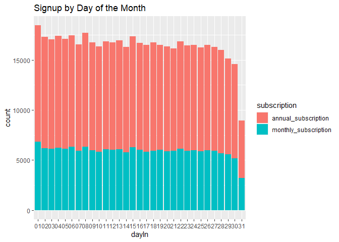<!-- -->

``` r
ggplot(consolidated_cancellation,aes(x=dayOut, fill=subscription)) + geom_bar(stat = "count") + ggtitle("Cancellation by Day of the Month")
```

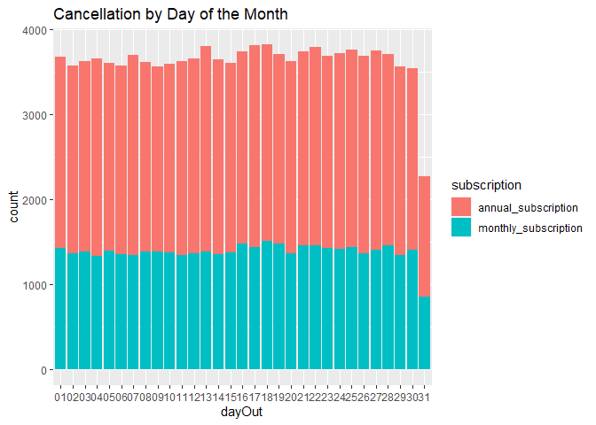<!-- -->

``` r
ggplot(consolidated_modified,aes(x=hourIn, fill=subscription)) + geom_bar(stat = "count") + ggtitle("Signup by Time of the Day")
```

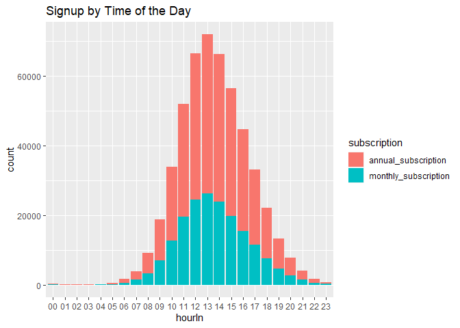<!-- -->

``` r
ggplot(consolidated_cancellation,aes(x=hourOut, fill=subscription)) + geom_bar(stat = "count") + ggtitle("Cancellation by Time of the Day")
```

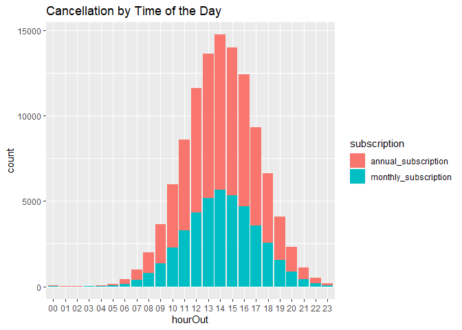<!-- -->

``` r
ggplot(consolidated_modified,aes(x=AMPMIn, fill=subscription)) + geom_bar(stat = "count") + ggtitle("Signup by Period of the Day")
```

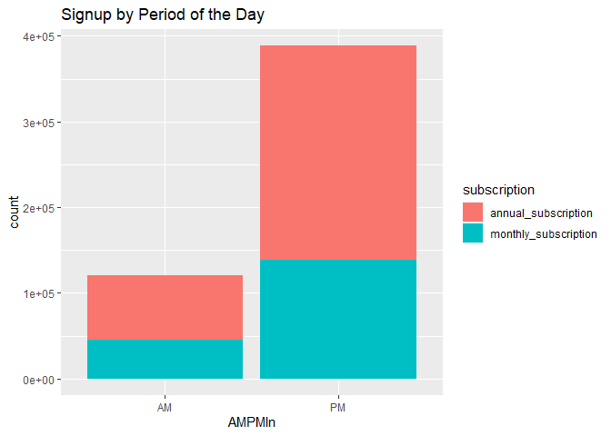<!-- -->

``` r
ggplot(consolidated_cancellation,aes(x=AMPMOut, fill=subscription)) + geom_bar(stat = "count") + ggtitle("Cancellation by Period of the Day")
```

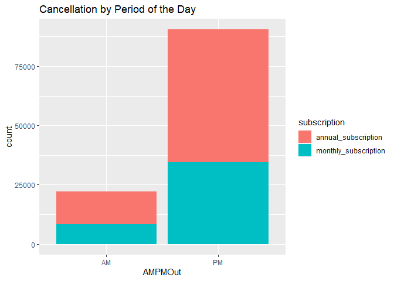<!-- -->

``` r
#create churn status column
consolidated_modified$churn <- ifelse(is.na(consolidated_modified$cancel_date_time),"No", "Yes")
```

``` r
#convert churn column type to factor
consolidated_modified$churn <- factor(consolidated_modified$churn)
```

``` r
str(consolidated_modified)
```

    ## 'data.frame':    508932 obs. of  24 variables:
    ##  $ customer_id     : chr  "C10000" "C100000" "C100001" "C100002" ...
    ##  $ product_id      : chr  "prd_1" "prd_2" "prd_1" "prd_1" ...
    ##  $ signup_date_time: POSIXct, format: "2017-07-09 12:55:31" "2021-02-13 11:41:49" ...
    ##  $ cancel_date_time: POSIXct, format: NA NA ...
    ##  $ subscription    : Factor w/ 2 levels "annual_subscription",..: 1 2 1 1 1 1 2 2 1 2 ...
    ##  $ price           : int  1200 125 1200 1200 1200 1200 125 125 1200 125 ...
    ##  $ billing_cycle   : int  12 1 12 12 12 12 1 1 12 1 ...
    ##  $ age             : int  46 54 27 47 63 40 69 48 60 60 ...
    ##  $ gender          : Factor w/ 2 levels "female","male": 1 1 1 1 1 2 1 1 2 1 ...
    ##  $ yearIn          : Factor w/ 5 levels "2017","2018",..: 1 5 5 5 5 5 5 5 5 5 ...
    ##  $ monthIn         : Factor w/ 12 levels "Apr","Aug","Dec",..: 6 4 4 4 4 4 4 4 4 4 ...
    ##  $ dayIn           : chr  "09" "13" "13" "13" ...
    ##  $ dayNameIn       : Factor w/ 7 levels "Fri","Mon","Sat",..: 4 3 3 3 3 3 3 3 3 3 ...
    ##  $ hourIn          : chr  "13" "11" "11" "11" ...
    ##  $ minuteIn        : chr  "55" "41" "45" "51" ...
    ##  $ AMPMIn          : Factor w/ 2 levels "AM","PM": 2 1 1 1 1 2 2 2 2 2 ...
    ##  $ yearOut         : Factor w/ 5 levels "2017","2018",..: NA NA NA NA NA NA NA NA NA NA ...
    ##  $ monthOut        : Factor w/ 12 levels "Apr","Aug","Dec",..: NA NA NA NA NA NA NA NA NA NA ...
    ##  $ dayOut          : chr  NA NA NA NA ...
    ##  $ dayNameOut      : Factor w/ 7 levels "Fri","Mon","Sat",..: NA NA NA NA NA NA NA NA NA NA ...
    ##  $ hourOut         : chr  NA NA NA NA ...
    ##  $ minuteOut       : chr  NA NA NA NA ...
    ##  $ AMPMOut         : Factor w/ 2 levels "AM","PM": NA NA NA NA NA NA NA NA NA NA ...
    ##  $ churn           : Factor w/ 2 levels "No","Yes": 1 1 1 1 1 1 1 1 1 1 ...

``` r
#look at some characeristics
summary(consolidated_modified$subscription)
```

    ##  annual_subscription monthly_subscription 
    ##               325649               183283

``` r
#looking at the dependent variable (binary - Churn or not)
summary(consolidated_modified$churn)
```

    ##     No    Yes 
    ## 396447 112485

``` r
#isolating data for tree classification
churn_data <- consolidated_modified[,c(5,8,9,10,11,12,13,14,15,16,24)]
str(churn_data)
```

    ## 'data.frame':    508932 obs. of  11 variables:
    ##  $ subscription: Factor w/ 2 levels "annual_subscription",..: 1 2 1 1 1 1 2 2 1 2 ...
    ##  $ age         : int  46 54 27 47 63 40 69 48 60 60 ...
    ##  $ gender      : Factor w/ 2 levels "female","male": 1 1 1 1 1 2 1 1 2 1 ...
    ##  $ yearIn      : Factor w/ 5 levels "2017","2018",..: 1 5 5 5 5 5 5 5 5 5 ...
    ##  $ monthIn     : Factor w/ 12 levels "Apr","Aug","Dec",..: 6 4 4 4 4 4 4 4 4 4 ...
    ##  $ dayIn       : chr  "09" "13" "13" "13" ...
    ##  $ dayNameIn   : Factor w/ 7 levels "Fri","Mon","Sat",..: 4 3 3 3 3 3 3 3 3 3 ...
    ##  $ hourIn      : chr  "13" "11" "11" "11" ...
    ##  $ minuteIn    : chr  "55" "41" "45" "51" ...
    ##  $ AMPMIn      : Factor w/ 2 levels "AM","PM": 2 1 1 1 1 2 2 2 2 2 ...
    ##  $ churn       : Factor w/ 2 levels "No","Yes": 1 1 1 1 1 1 1 1 1 1 ...

``` r
summary(churn_data)
```

    ##                subscription         age           gender        yearIn      
    ##  annual_subscription :325649   Min.   :21.00   female:199002   2017: 30896  
    ##  monthly_subscription:183283   1st Qu.:53.00   male  :309930   2018: 58099  
    ##                                Median :59.00                   2019:109876  
    ##                                Mean   :58.47                   2020:145642  
    ##                                3rd Qu.:64.00                   2021:164419  
    ##                                Max.   :78.00                                
    ##                                                                             
    ##     monthIn          dayIn           dayNameIn       hourIn         
    ##  Mar    : 54664   Length:508932      Fri: 66426   Length:508932     
    ##  Apr    : 52914   Class :character   Mon:107779   Class :character  
    ##  Jan    : 52805   Mode  :character   Sat: 37735   Mode  :character  
    ##  May    : 51936                      Sun: 28989                     
    ##  Feb    : 48388                      Thu: 81831                     
    ##  Jun    : 47908                      Tue: 95682                     
    ##  (Other):200317                      Wed: 90490                     
    ##    minuteIn         AMPMIn      churn       
    ##  Length:508932      AM:120577   No :396447  
    ##  Class :character   PM:388355   Yes:112485  
    ##  Mode  :character                           
    ##                                             
    ##                                             
    ##                                             
    ## 

``` r
#convert some column type to factor
churn_data$dayIn <- factor(churn_data$dayIn)
churn_data$hourIn <- factor(churn_data$hourIn)
churn_data$minuteIn <- factor(churn_data$minuteIn)
```

``` r
set.seed(427) #setting seed 
train_sample <- sample(508932, 470000)

#view train sample data type structure
str(train_sample)
```

    ##  int [1:470000] 101589 334339 301126 19531 25124 477442 34056 279323 303645 34196 ...

``` r
#splitting data for training and testing
churn_train <- churn_data[train_sample,] #training data
churn_test <- churn_data[-train_sample,] #test data
```

``` r
# check the proportion of class variable
prop.table(summary(churn_train$churn))
```

    ##       No      Yes 
    ## 0.779017 0.220983

``` r
prop.table(summary(churn_test$churn))
```

    ##        No       Yes 
    ## 0.7785113 0.2214887

``` r
#training a model on the data
#load C50 library
#install.packages("C50")
library(C50)
```

``` r
churn_model <- C5.0(churn_train[-11],churn_train$churn,control = C5.0Control(minCases = 2000))

churn_model
```

    ## 
    ## Call:
    ## C5.0.default(x = churn_train[-11], y = churn_train$churn, control
    ##  = C5.0Control(minCases = 2000))
    ## 
    ## Classification Tree
    ## Number of samples: 470000 
    ## Number of predictors: 10 
    ## 
    ## Tree size: 3 
    ## 
    ## Non-standard options: attempt to group attributes, minimum number of cases: 2000

``` r
#display detailed info about the tree
summary(churn_model)
```

    ## 
    ## Call:
    ## C5.0.default(x = churn_train[-11], y = churn_train$churn, control
    ##  = C5.0Control(minCases = 2000))
    ## 
    ## 
    ## C5.0 [Release 2.07 GPL Edition]      Sat Jul 23 03:35:43 2022
    ## -------------------------------
    ## 
    ## Class specified by attribute `outcome'
    ## 
    ## Read 470000 cases (11 attributes) from undefined.data
    ## 
    ## Decision tree:
    ## 
    ## subscription = annual_subscription: No (300770/64386)
    ## subscription = monthly_subscription:
    ## :...yearIn = 2017: Yes (4914/2260)
    ##     yearIn in {2018,2019,2020,2021}: No (164316/36822)
    ## 
    ## 
    ## Evaluation on training data (470000 cases):
    ## 
    ##      Decision Tree   
    ##    ----------------  
    ##    Size      Errors  
    ## 
    ##       3 103468(22.0%)   <<
    ## 
    ## 
    ##      (a)    (b)    <-classified as
    ##    -----  -----
    ##   363878   2260    (a): class No
    ##   101208   2654    (b): class Yes
    ## 
    ## 
    ##  Attribute usage:
    ## 
    ##  100.00% subscription
    ##   36.01% yearIn
    ## 
    ## 
    ## Time: 9.6 secs

``` r
#plot the tree
#plot(churn_model) #gives unresolved error
```

``` r
#install.packages("gmodels") 
library(gmodels)
```

``` r
## Step 3: Evaluating model performance by using test data 
# create a factor vector of predictions on test data
churn_pred <- predict(churn_model,churn_test)

# cross tabulation of predicted versus actual classes
CrossTable(churn_test$churn, churn_pred, 
           prop.chisq = FALSE, prop.c = FALSE, prop.r = FALSE,
           dnn = c('actual default','predicted default'))
```

    ## 
    ##  
    ##    Cell Contents
    ## |-------------------------|
    ## |                       N |
    ## |         N / Table Total |
    ## |-------------------------|
    ## 
    ##  
    ## Total Observations in Table:  38932 
    ## 
    ##  
    ##                | predicted default 
    ## actual default |        No |       Yes | Row Total | 
    ## ---------------|-----------|-----------|-----------|
    ##             No |     30116 |       193 |     30309 | 
    ##                |     0.774 |     0.005 |           | 
    ## ---------------|-----------|-----------|-----------|
    ##            Yes |      8389 |       234 |      8623 | 
    ##                |     0.215 |     0.006 |           | 
    ## ---------------|-----------|-----------|-----------|
    ##   Column Total |     38505 |       427 |     38932 | 
    ## ---------------|-----------|-----------|-----------|
    ## 
    ## 
